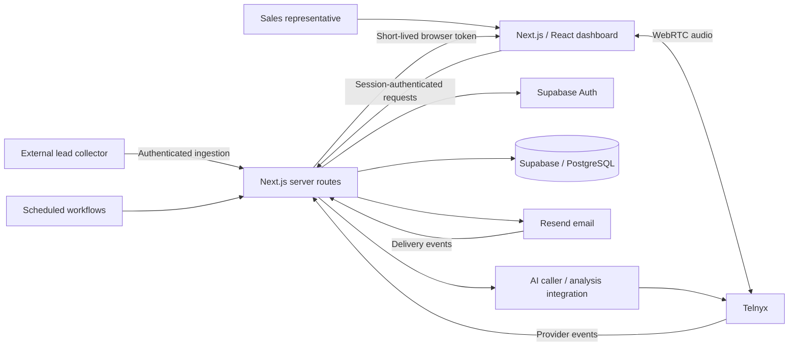

# Team Gold CRM

A CRM for workflows at my company, Team Gold: collect and qualify business leads, distribute work to representatives, make browser-based calls, coordinate outreach, and inspect outcomes in one dashboard.

**Sanitized portfolio edition of a private production system.** This repository presents its architecture and three selected, independently testable source excerpts. It contains no production access, customer records, recordings, or private Git history. It is a case study, not the deployable CRM.

## Tech stack

**Next.js · React · TypeScript · Supabase/PostgreSQL · Telnyx WebRTC · Resend · Vercel**

The private project uses the Next.js App Router, server-side API routes, Supabase authentication and database clients, browser telephony, provider event handlers, and scheduled workflows.

## What problem it solves

Sales work spans disconnected lead lists, browser calls, follow-ups and outcome tracking. The CRM brings those steps into a shared workflow: ingestion and normalization, controlled lead release, assigned contact queues, calls, email outreach, and dashboard review.

## Key features in the private system

- **Lead pipeline:** authenticated ingestion, field normalization, batch tracking, enrichment and controlled release to representatives.
- **CRM workflows:** contact queues, assignments, status changes, activity timelines and role-oriented dashboards.
- **Browser calling:** Telnyx WebRTC, server-side token issuance, representative-specific telephony credentials and caller-number selection.
- **Email/outreach:** shared sending logic, editable templates, mailbox allocation, recipient deduplication and delivery-event handling.
- **Operational dashboards:** call review, recordings, costs, lead activity, team management and outreach views.
- **AI/automation:** AI-caller routes, assistant context/tools, call analysis, scheduling and approval-oriented outreach workflows. Provider configuration and operational prompts remain private.

These features are evidenced by the reviewed private source. This showcase does not certify that every route is enabled or every migration is deployed in production.

## System architecture



The lead collector is a separate system; its implementation is not included here. The diagram is a high-level view, not an exhaustive deployment or trust-boundary map.

For a simplified API map, core data relationships and lead-to-outcome sequence, see [System walkthrough](docs/SYSTEM-WALKTHROUGH.md).

## Selected source excerpts

| Module | Why it matters |
|---|---|
| [phone.ts](src/lib/phone.ts) | Rejects phone imports without country context rather than guessing a dialing destination. |
| [normEmail.ts](src/lib/normEmail.ts) | Removes `mailto:` and display-name wrappers while preserving address content and local-part case. |
| [dedupeEmpfaenger.ts](src/lib/dedupeEmpfaenger.ts) | Keeps the first candidate per normalized recipient, preserving the original queue order. |

The helpers originate from the private system; this public edition additionally fixes phone-import edge cases (Italian geographic prefixes, unsafe numeric input and unsupported extensions). These changes have not been applied to the private CRM in this audit. Operational anecdotes and private examples in comments have been removed. The email normalizer removes wrappers; it is not a complete email-address validator. Phone normalization does not verify number ownership or reachability.

## Engineering challenges

- **Boundary between browser and server:** provider API secrets stay on the server; browser calling obtains a session-authorized token.
- **Safe imports:** normalization must repair known formatting problems without inventing missing country or address data.
- **Shared behavior:** dashboard and batch workflows reuse helpers so recipient selection and mail formatting do not drift.
- **Multi-representative calling:** individual telephony credentials avoid coupling browser sessions; caller identity is selected separately.
- **Schema/deployment drift:** source migrations and a successful TypeScript check do not prove the deployed database or Next.js build matches the intended state.
- **Production operations:** Vercel deployment configuration and scheduled handlers are represented at architecture level; credentials and operational runbooks are excluded.

See [engineering decisions](docs/ENGINEERING.md).

## Run the isolated examples

Node.js 24 or newer; no install, cloud accounts or environment variables required:

```sh
npm test
```

For the strict TypeScript check, run `npm ci` and `npm run typecheck`. GitHub Actions runs both the helper tests and the type check. TypeScript is a development dependency only.

Tests cover only the included pure helpers. They do not test the private CRM, provider integrations, RLS policies or live deployment. All contact examples are invented and use reserved example domains and fictional telephone numbers. No calls or messages are sent.

## Screenshots

Production screenshots are intentionally excluded. A screenshot can expose lead records, phone numbers, emails, internal notes or tokens. This edition uses a diagram and source excerpts rather than copying an unverified dashboard capture.

## Security & privacy

Publication uses an explicit file allowlist, fresh repository history and synthetic examples. No environment files, service-role keys, provider credentials, production IDs, customer/employee records, call transcripts or operational notes are included. Private database migrations and provider routes are excluded.

The private source contains authentication, webhook-verification and RLS mechanisms; their presence is not a claim of complete security or verified deployment. See [publication boundaries](docs/SECURITY.md).

No open-source license is assigned yet. A license should be chosen by the owner after deciding which reuse rights to grant.
