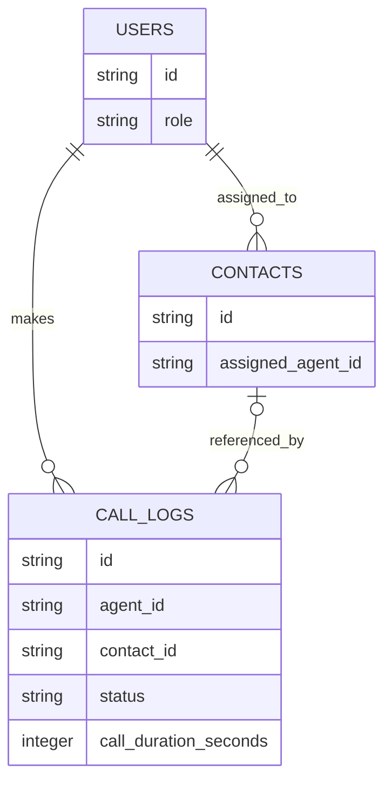

# System walkthrough

This is a simplified view grounded in the private source. It is not the current production database schema, an API contract, or deployable configuration.

## API responsibilities

| Route | Method | Responsibility | Reviewed boundary |
|---|---|---|---|
| `/api/leads/ingest` | POST | Accept externally collected leads, normalize fields and attach batch metadata | Server-configured ingestion key |
| `/api/telnyx/token` | GET | Issue the browser calling token using server-side provider access | Supabase user-session check |
| `/api/telnyx/webhook` | POST | Process telephony provider events | Signature verification logic; effective configuration requires deployment review |
| `/api/webhooks/resend` | POST | Process email provider events | Signature verification logic |

These paths describe existing implementation responsibilities. No provider credentials, endpoint domains or live request examples are included.

## Simplified core data model

The initial migration establishes users, assigned contacts and call logs. Later migrations evolve this model. Only those core relationships are illustrated here; this is not an export of production data or a claim about the complete deployed schema.

Supabase Auth handles identity; application users carry the sales roles. Contacts can have an assigned representative. Call logs link the representative and optionally a contact. The private source contains RLS policies; effective production enforcement has not been inspected from the live database.

## Lead-to-outcome workflow

1. A separate collector submits leads to the ingestion route.
2. The CRM normalizes supplied phone/email fields and records batch context.
3. Administrator-controlled release and assignment organize representative queues.
4. An authenticated representative obtains a browser token and makes WebRTC calls.
5. Provider events update call activity; dashboard workflows support review and follow-up.
6. Shared outreach logic selects recipients and sends email; email events feed the workflow.

This is a conceptual sequence. It is not a guarantee that every optional module is enabled or that every business workflow runs automatically.

## Deployment evidence and measurable results

The source includes Vercel configuration, scheduled routes and Supabase migrations. This public edition tests three isolated helpers with synthetic inputs. It does not expose production logs or claim conversion improvements, savings, user counts or uptime.

A future operational case-study update requires verified, publishable evidence from the system operator. Screenshots must come from an isolated synthetic-data session; masking a live customer dashboard is insufficient assurance.
